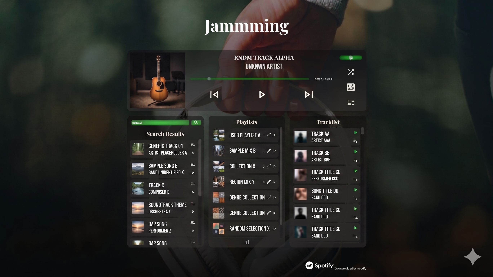
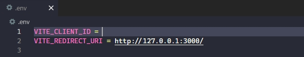

# Jammming


*Jammming - User interface with mocking data.*
*The picture was built using AI. However, the whole code was designed by a human, AI was only used as a support in some debugging and design parts to understand unknown concepts faster.* 

## Description
In this project, it was aimed to create a music interface "_Jammming_" in React using data provided from Spotify. The application was built as a practice and as a part of a fullstack course. The project was quite usefull in terms of improving knowledge and providing practice about how to implement main React structure in a project, built component relations, modular css files, css limits, http requests and so on. _Jammming_ has several easy to use functionalities and a compleling UI.

## Features
- Allows searching for tracks and displays results under _Results_ title.
- Displays users owned playlists under _Playlists_ title.
- Allows modifying playlist's name.
- Allows creating a new playlist.
- When a playlists image is clicked, corresponding tracks are shown in under _Tracklist_ title.
- Tracklists can be modified
    - A track can be removed from _Playlists_ section
    - A track can be added and removed from _Results_ section
    - When there is a change in the tracklist, apply and cancel changes buttons appear under tracklist.
    - Until applying changes, no related request is done to the Spotify API.
- Allows users to play songs on the app.
    - Following features are allowed: Pause-play, previous song, next song, repeat, shuffle, device selection, volume adjustment.
- Also allows control over other devices when they are selected.
- Other details: 
    - When app is first launced, current app is selected as the current device. To see that, you can refresh the devices tab.
    - _Playlists_ and _Tracklists_ sections are automatically requested in 1 hour intervals. Hence, when there is a change on your device like creating a playlist or adding new songs to your tracklist, these mostly wont be captured in the app automatically. These sections were designed in this way to prevent too many request ban(429). I don't know exact rate limits however, I encountered playlits and tracklist related bans when I use auto updates including up to 3 second intervals. Because these bans were too long (They were 1 day in my case), I did not check some other time intervals and set them to 1 hours directly. In order the updates you can do the following.
        - _Playlists_ section is updated when you rename a playlist or when you createa a new playlist.
        - _Tracklist_ is updated when you select a new playlist or when you update your playlist.
    - Some other states like volume, playing song durations, playing state and so on, are updated in 3 second intervals and also when you make a request like like when you click pause button.
    
## Prerequisites
1. **Spotify Premium Account**, several functionalities of the app require a premium account.
2. **Node**, in order to run the app, you need [node](https://nodejs.org/en/download).
3. **git**, this is for cloning the app using [git](https://git-scm.com/) on your computer, it is not obligatory.  

## How to use
1. First clone the app using the following code on your computer or if you do not prefer this, use another approach and download the files.

    ``` 
    git clone https://github.com/kullaniciadi/jammming.git
    cd Jammming
    ```

2. Next, go the [Spotify Developer Dashboard](https://developer.spotify.com/dashboard). 

3. There, you need to click on the create app. App details shuld be as follows.
    - App Name: Jammming
    - Redirect uri: http://127.0.0.1:3000/
    - APs used: Web API, Web Playback SDK
4. After you create the app, you will need to copy your Client ID and insert it into the .env located in the same location as of Jammming named folder. In the below image, you see where to insert the Client ID.

    

5. Next, inside Jammming, use the following code to install packages required. If you use or downloaded another package manager rather than _npm_, you need to check how to install packages using it.
    ```
    npm install
    ```
6. Finally, when you you run the following command, the app will open in your default browser. Again, if you use another package manager istead of _npm_, check its documentation for proper code.
    ```
    npm run dev
    ```

## Technologies 

* [React.js](https://reactjs.org/)
* [Vite](https://vitejs.dev/)
* [Spotify Web Playback SDK](https://developer.spotify.com/documentation/web-playback-sdk/) - Used for music playback functionality.
* [Spotify Web API](https://developer.spotify.com/documentation/web-api/) - Used for searching tracks, managing playlists and other functionalities.

## License
This project is licensed under the [MIT](LICENSE) License.

## Acknowledgements
* Data and playback functionality provided by [Spotify Web API](https://developer.spotify.com/documentation/web-api/).
* This project is a personal portfolio piece and is not affiliated with or endorsed by Spotify.

## Disclaimer
This application is for educational purposes only. While it uses the Spotify Web API to manage playlists, the developer is not responsible for any accidental data loss or changes to your Spotify account. Use it at your own risk.